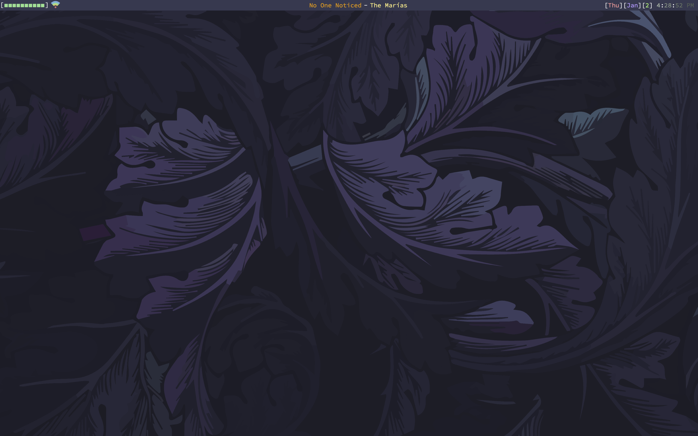

# MyBar - Menubar for Mac

MyBar is a custom menubar for OSX for use with Übersicht. 



Modified from [MrGVSV's mybar](https://github.com/MrGVSV/mybar.git) widget.


## Installation

Download and install Übersicht from their website: [http://tracesof.net/uebersicht/](http://tracesof.net/uebersicht/).

Then simply clone this repository into your Übersicht widgets folder.

```shell
git clone https://github.com/MrGVSV/mybar.git ~/Library/Application\ Support/Übersicht/widgets/mybar/
```

(Also be sure to set Automatically Hide and Show the Menu Bar in Preferences > General if you want to "replace" it.)
